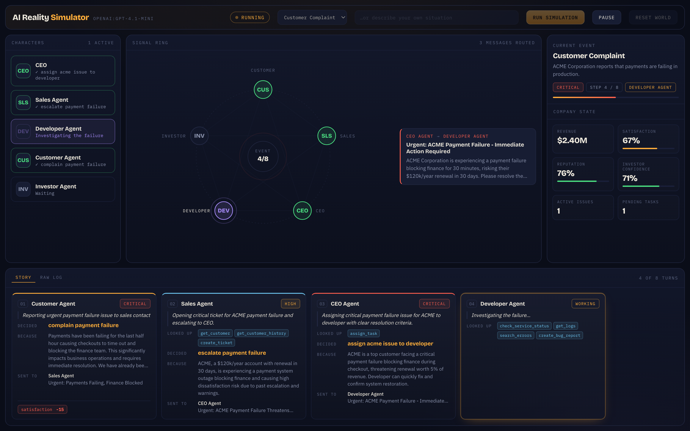
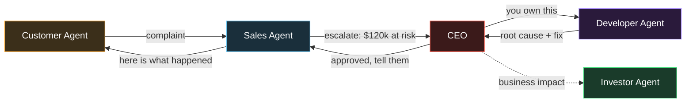

# AI Reality Simulator

A virtual company staffed by five AI characters. You trigger a business event
a customer complains and then you watch the company deal with it by itself.

Nobody types into a chatbox. The agents read the situation, look things up in a
database, message each other, make decisions, and those decisions change the
company's numbers. All of it appears live on one dashboard.

The whole idea in one line:

```text
ONE EVENT  →  FIVE AI AGENTS  →  THEY TALK  →  THEY DECIDE  →  THE COMPANY CHANGES
```



---

## 1. Two ways to start

**Pick a preset** from the dropdown Customer Complaint runs the hand-written
8-turn workflow below.

**Or type your own situation** in the box next to it and press Run. Anything
works: *"Our AWS bill tripled overnight"*, *"A journalist is asking about a data
leak"*, *"Our biggest competitor just cut prices by half"*. The company runs a
generic six-turn flow against whatever you typed the CEO triages it, the
developer investigates, sales reads the customer impact, the CEO decides, the
customer reacts, the investor judges.

---

## 2. What actually happens when you press "Run simulation"

The system runs **8 turns** for the preset (6 for a typed situation). In each
turn, exactly one agent wakes up, thinks, uses its tools, and acts.

```text
                        YOU PRESS "RUN SIMULATION"
                                   │
                                   ▼
    ┌──────────────────────────────────────────────────────────────┐
    │  TURN 1 CUSTOMER AGENT                                     │
    │  "Payments are failing. My finance team is blocked."         │
    │  → sends complaint to Sales                                  │
    │  → satisfaction  82 → 67                                     │
    └──────────────────────────────────────────────────────────────┘
                                   │
                                   ▼
    ┌──────────────────────────────────────────────────────────────┐
    │  TURN 2 SALES AGENT                                        │
    │  tools: get_customer() get_customer_history() create_ticket()│
    │  Learns: ACME is $120k/year, renews in 30 days, already      │
    │          complained once, is eyeing a competitor             │
    │  → escalates to CEO with the money and the deadline          │
    └──────────────────────────────────────────────────────────────┘
                                   │
                                   ▼
    ┌──────────────────────────────────────────────────────────────┐
    │  TURN 3 CEO                                                │
    │  tools: get_company_metrics() assign_task()                  │
    │  → gives the problem ONE owner: the Developer                │
    └──────────────────────────────────────────────────────────────┘
                                   │
                                   ▼
    ┌──────────────────────────────────────────────────────────────┐
    │  TURN 4 DEVELOPER AGENT                                    │
    │  tools: check_service_status() get_logs() search_errors()    │
    │         create_bug_report()                                  │
    │  Finds the real log line:                                    │
    │    "Upstream timeout after 5000ms calling processor gateway" │
    │  → reports root cause + fix to CEO                           │
    └──────────────────────────────────────────────────────────────┘
                                   │
                                   ▼
    ┌──────────────────────────────────────────────────────────────┐
    │  TURN 5 CEO                                                │
    │  tools: approve_action() resolve_ticket() complete_task()    │
    │  → approves the fix, CLOSES the ticket                       │
    │  → active issues  1 → 0                                      │
    └──────────────────────────────────────────────────────────────┘
                                   │
                                   ▼
    ┌──────────────────────────────────────────────────────────────┐
    │  TURN 6 SALES AGENT                                        │
    │  → writes the reply to the customer                          │
    └──────────────────────────────────────────────────────────────┘
                                   │
                                   ▼
    ┌──────────────────────────────────────────────────────────────┐
    │  TURN 7 CUSTOMER AGENT                                     │
    │  Judges the answer: was it fast? was it specific?            │
    │  → satisfaction  67 → 77                                     │
    └──────────────────────────────────────────────────────────────┘
                                   │
                                   ▼
    ┌──────────────────────────────────────────────────────────────┐
    │  TURN 8 INVESTOR AGENT                                     │
    │  tools: get_revenue() get_customer_metrics()                 │
    │         get_company_report()                                 │
    │  → "handled competently"                                     │
    │  → investor confidence  71 → 76                              │
    └──────────────────────────────────────────────────────────────┘
                                   │
                                   ▼
                            SIMULATION COMPLETE
```

A full run takes about 60–90 seconds, because each turn is a real call to the
language model.

---

## 3. Who talks to whom

The message routing is the point of the project. This is the path a complaint
takes through the company:



On the dashboard this is the **signal ring** in the middle. The five agents sit
in a pentagon, and every message flies across the circle as a glowing dot.

---

## 4. What happens inside ONE turn

This is the engine's core loop. It is the same for all five agents.

```text
   ENGINE picks the next step
            │
            ▼
   ┌────────────────────────────────────────────────┐
   │ BUILD THE PROMPT                               │
   │   • the task for this turn                     │
   │   • long-term memory  (from SQLite)            │
   │   • short-term memory (this run only)          │
   │   • current company numbers                    │
   └────────────────────────────────────────────────┘
            │
            ▼
   ┌────────────────────────────────────────────────┐
   │ SEND TO THE MODEL (gpt-4.1-mini)               │
   └────────────────────────────────────────────────┘
            │
            ▼
   ┌────────────────────────────────────────────────┐
   │ MODEL CALLS TOOLS  ◄──────────┐                │
   │   get_customer_history(...)   │ loops until    │
   │   get_logs(...)               │ it has enough  │
   │   create_ticket(...)  ────────┘ facts          │
   │                                                │
   │   every tool call is pushed to the screen      │
   │   immediately → "Searching logs…"              │
   └────────────────────────────────────────────────┘
            │
            ▼
   ┌────────────────────────────────────────────────┐
   │ MODEL RETURNS A STRUCTURED DECISION            │
   │ {                                              │
   │   "thought":   "Reviewing ACME's history",     │
   │   "decision":  "escalate_to_ceo",              │
   │   "reason":    "$120k, renews in 30 days",     │
   │   "priority":  "critical",                     │
   │   "message":   { to: "ceo", subject, body },   │
   │   "state_delta": { "satisfaction": -10 },      │
   │   "remember":  "ACME escalates fast"           │
   │ }                                              │
   └────────────────────────────────────────────────┘
            │
            ▼
   ┌────────────────────────────────────────────────┐
   │ ENGINE APPLIES IT                              │
   │   message   → delivered to the other agent's   │
   │               short-term memory + flies on ring│
   │   delta     → company numbers change           │
   │   remember  → saved to long-term memory        │
   │   everything → pushed to the browser           │
   └────────────────────────────────────────────────┘
            │
            ▼
       NEXT TURN
```

**The key idea:** the agent does not just write text. It returns a *structured
object*, which the engine can act on mechanically. That is what turns words into
a running simulation.

---

## 5. How the screen updates live

```text
   BROWSER                          SERVER
   ───────                          ──────
                                    Simulation Engine
   ┌──────────────┐                        │
   │  dashboard   │                        │ emits events:
   │              │                        │   step_started
   │  Alpine.js   │◄═══ WebSocket ═════════┤   tool_call
   │              │      /ws               │   thought
   │  updates     │                        │   message
   │  instantly   │                        │   decision
   └──────────────┘                        │   state_update
          │                                │   memory_stored
          │ button clicks                  │   run_completed
          ▼                                │
   POST /api/simulation/trigger  ──────────┘
        /pause  /resume  /reset
```

Controls go **up** over normal HTTP. Everything the agents do comes **down** over
one WebSocket. The browser never polls.

If you refresh mid-run, the server replays the events so the screen redraws
correctly instead of going blank.

---

## 6. What you see on the dashboard

```text
┌──────────────────────────────────────────────────────────────────────────┐
│ AI Reality Simulator   [Idle] [Preset ▼] [type your own…] [Run] [Reset]  │
├──────────┬────────────────────────────────────┬──────────────────────────┤
│CHARACTERS│           SIGNAL RING              │  CURRENT EVENT           │
│          │                                    │  Customer Complaint      │
│ CEO      │            CUSTOMER                │  critical · step 4 / 8   │
│ ✓ decided│               ○                    │  ──────────────────────  │
│          │      ○               ○             │  COMPANY STATE           │
│ SALES    │  INVESTOR         SALES            │  revenue     $2.40M      │
│ ✓ escal. │        ┌───────┐        ┌────────┐ │  satisfaction    77%     │
│          │        │  4/8  │        │ latest │ │  reputation      73%     │
│ DEVELOPER│        └───────┘        │message │ │  confidence      76%     │
│ ● think… │      ○               ○  └────────┘ │  issues 0   tasks 2      │
│          │     DEV             CEO            │                          │
│ CUSTOMER │                                    │                          │
│ ✓ filed  │  ← messages fly across as dots     │                          │
├──────────┴────────────────────────────────────┴──────────────────────────┤
│ STORY  ·  raw log                                        4 of 8 turns    │
│ ┌────────────────┐ ┌────────────────┐ ┌────────────────┐ ┌─────────────┐ │
│ │01 CUSTOMER     │ │02 SALES  HIGH  │ │03 CEO CRITICAL │ │04 DEV  WORK │ │
│ │"Payments have  │ │"Reviewing the  │ │"Assigning this │ │"Investigat…"│ │
│ │ been failing…" │ │ account…"      │ │ to developer"  │ │             │ │
│ │                │ │LOOKED UP       │ │LOOKED UP       │ │LOOKED UP    │ │
│ │DECIDED         │ │ get_customer   │ │ assign_task    │ │ get_logs    │ │
│ │ send complaint │ │ create_ticket  │ │DECIDED         │ │ search_err… │ │
│ │BECAUSE         │ │DECIDED         │ │ assign owners  │ │             │ │
│ │ finance blocked│ │ escalate_to_ceo│ │BECAUSE         │ │             │ │
│ │SENT TO Sales   │ │BECAUSE $120k…  │ │ $120k renewal  │ │             │ │
│ │satisfaction −20│ │SENT TO CEO     │ │reputation −2   │ │             │ │
│ └────────────────┘ └────────────────┘ └────────────────┘ └─────────────┘ │
└──────────────────────────────────────────────────────────────────────────┘
```

**The story strip along the bottom is the point.** Each turn becomes one card,
read left to right in the order it happened, showing the same five things every
time: what the agent **looked up**, what it **decided**, **because** of what, who
it **sent** to, and what that **changed**. The card of the agent currently working
glows and fills in live.

Switch to **Raw log** for the unfiltered stream of every event.

Click any character card on the left to open its brain: personality, goals,
tools, and both kinds of memory.

## 7. What was built, file by file

```text
backend/
│
├── main.py              FastAPI app. Serves the page, runs the WebSocket.
├── config.py            Reads .env (your API key and model name).
├── db.py                SQLite: 11 tables, seed data, derived counters.
├── schemas.py           The shape of an agent's answer (AgentDecision).
├── deps.py              What gets injected into tools when they run.
│
├── agents/              THE FIVE CHARACTERS
│   ├── base.py          Shared rules + the factory that builds an agent.
│   ├── ceo.py           Decisive. 6 tools. Assigns owners, closes incidents.
│   ├── sales.py         Protective of accounts. 3 tools. Escalates early.
│   ├── developer.py     Evidence-driven. 4 tools. Won't guess a root cause.
│   ├── customer.py      Impatient enterprise buyer. 2 tools. Sets satisfaction.
│   └── investor.py      Detached and numerate. 3 tools. Judges the handling.
│
├── simulation/          THE MACHINERY
│   ├── engine.py        The runner. Walks the steps, applies decisions.
│   ├── events.py        The workflows, written as data. 8 steps for a complaint.
│   └── bus.py           Broadcasts every event to connected browsers.
│
├── memory/
│   ├── short_term.py    What an agent saw during THIS run. Cleared on reset.
│   └── long_term.py     Durable facts, kept in SQLite between runs.
│
├── tools/               16 TOOLS what agents can actually DO
│   ├── customer.py      get_customer, get_customer_history, create_ticket
│   ├── developer.py     check_service_status, get_logs, search_errors,
│   │                    create_bug_report
│   └── company.py       get_company_metrics, assign_task, approve_action,
│                        get_revenue, get_customer_metrics, get_company_report,
│                        get_open_tickets, resolve_ticket, complete_task
│
└── api/routes.py        The buttons: trigger, pause, resume, reset.

templates/index.html     The whole dashboard, one file.
static/css/app.css       The look: light slate-and-blue console.
static/js/app.js         WebSocket client, the ring, the flying messages.
```

---

## 8. The database

Created automatically on first run as `simulator.db`.

```text
THE WORLD                     WHAT AGENTS PRODUCE          THE RECORD
─────────                     ───────────────────          ──────────
customers          ─────┐     tickets                      runs
  ACME, $120k/yr        │     bug_reports                  run_events
customer_history        │     tasks                          (full replay
  4 past events         │                                     of every run)
services           ─────┤     agent_memory
  payment-api: degraded │       what agents chose
logs                    │       to remember
  real error lines      │
                        └──►  company_state
                                revenue, satisfaction,
                                reputation, confidence,
                                active_issues, pending_tasks
```

The seeded world is deliberately loaded: ACME already complained once, already
escalated once, and is already talking to a competitor. The `payment-api` is
already degraded with real timeout logs. So when the Sales agent looks up the
history, it finds a genuine reason to panic.

---

## 9. Two rules that keep it honest

**Opinions are agent-set. Facts are derived.**

```text
   AGENT MAY SET              SYSTEM COUNTS
   ─────────────              ─────────────
   satisfaction               active_issues   ← counted from the tickets table
   reputation                 pending_tasks   ← counted from the tasks table
   investor_confidence

   These are judgements.      These are facts. If an agent forgot to
   Only an agent can          decrement one, the number would drift and
   decide them.               lie so the agent is never asked for it.
```

**Some numbers belong to one character.** Only the Customer changes customer
satisfaction. Only the Investor changes investor confidence. Enforced in code
(`DELTA_OWNERS` in `engine.py`), not in the prompt during testing the Sales
agent tried to set customer satisfaction itself, and was refused.

---

## 10. Running it

```bash
python3 -m venv .venv
./.venv/bin/pip install -r requirements.txt
./.venv/bin/python -m uvicorn backend.main:app --reload --port 8000
```

Open <http://127.0.0.1:8000> and press **Run simulation**.

`.env` needs:

```
OPENAI_API_KEY="sk-..."
MODEL_NAME="openai:gpt-4.1-mini"
```

Optional: `MIN_STEP_SECONDS` (how long each step is held on screen, default 1.6
raise it if the demo runs too fast to read), `DB_PATH`.

---

## 11. Adding the other preset events

You do not need this to run a new scenario just type it into the box. Add a
preset when you want a hand-tuned workflow with specific per-turn instructions.

Events are data, not code. The engine does not know what a complaint is it just
walks a list of steps. To add "Production Bug", append an `EventDefinition` to
`backend/simulation/events.py` and register it in `CATALOG`:

```python
PRODUCTION_BUG = EventDefinition(
    key="production_bug",
    title="Production Bug",
    summary="The application is crashing for all users.",
    priority="critical",
    icon="alert",
    steps=[
        Step(actor="developer",
             label="Triaging the crash",
             task="Alerts are firing and users cannot load the app. "
                  "Investigate and report what is broken.",
             subjects=["payment-api"]),
        Step(actor="ceo", label="Deciding the response", task="..."),
        # ...
    ],
)

CATALOG = {
    CUSTOMER_COMPLAINT.key: CUSTOMER_COMPLAINT,
    PRODUCTION_BUG.key: PRODUCTION_BUG,      # ← appears in the dropdown
}
```

No engine changes, no frontend changes. The remaining five scenarios from the
spec production bug, lost customer, investor question, security incident, new
lead are each about twenty lines of this.

---

## 12. API reference

| Method | Path | Purpose |
| --- | --- | --- |
| GET | `/` | The dashboard |
| GET | `/api/state` | Everything needed to draw the screen |
| POST | `/api/simulation/trigger` | Start a preset `{"event": "customer_complaint"}` or a typed one `{"event": "custom", "prompt": "..."}` |
| POST | `/api/simulation/pause` | Freeze between turns |
| POST | `/api/simulation/resume` | Continue |
| POST | `/api/simulation/reset` | Stop and restore the seeded world |
| GET | `/api/agents/{name}/memory` | One agent's short and long-term memory |
| GET | `/api/company` | State, tickets, bugs, tasks |
| WS | `/ws` | The live event stream |

Live event kinds on the WebSocket: `run_started`, `step_started`, `agent_status`,
`thought`, `tool_call`, `message`, `decision`, `state_update`, `memory_stored`,
`run_completed`, `run_failed`, `simulation_status`, `simulation_reset`.

---

## 13. The stack

| Layer | Choice | Why |
| --- | --- | --- |
| Agents | Pydantic AI | Structured outputs and tool calling, matches your `.env` model string |
| Backend | FastAPI + WebSocket | One channel pushes everything live |
| Frontend | Jinja template + Alpine.js | No build step, one HTML file |
| Storage | SQLite | Zero setup, created on first boot |

No Next.js, no npm, no bundler. Clone it, install four Python packages, run it.
